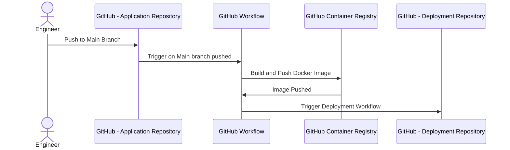

# Summary
This is a simple Spring Boot application that provides a RESTful API with two endpoints. The application is designed to demonstrate the deployment flow that integrates with ArgoCD

# Local Setup
1. Clone the repository
2. Setup your Environment
  - Ensure you have JDK installed. This application requires JDK 11 or higher.
  - Install [Maven](https://maven.apache.org/)
3. Run the Application:
```bash
mvn spring-boot:run
```
4. The Application can be accessed on `localhost:8080`

# CI/CD pipeline
## Separate of Application source code and Kubernetes manifests
The application source code and application deployment resources (.i.e K8s manifest files) are separated because of the following reasons:

- **Separation of Concerns**: This approach allows us to modify configuration files without triggering a full CI build, providing a clear distinction between application code and configuration.
- **Cleaner Audit Logs**: By isolating configuration changes, we maintain a cleaner Git history focused solely on configuration updates, free from the noise of regular development activity.
- **Support for Multi-Repo Applications**: Our application consists of services from multiple Git repositories, each with its own versioning scheme and release cycle. Storing manifests separately ensures a cohesive deployment process.
- **Access Control**: Different access permissions can be set for developers and production deployment, preventing unauthorized changes to production environments.
- **Avoiding CI Loops**: This separation prevents infinite loops of build jobs and Git commit triggers, ensuring a more stable and efficient CI pipeline.

## Trunk-Based Development
The CI/CD pipeline is designed for Trunk-Based Development flow. In trunk-based development:
- **Single Branch**: All developers work on a single branch (usually main or master), the single branch is expected to be deployable at all times.
- **Short-Lived Feature Branches**: Feature branches are short-lived and merged back into the main branch quickly to reduce merge conflicts.

## GitHub Workflows
The CI/CD pipeline is implemented using GitHub Workflows

### Build and Deploy Docker Image:

**Trigger**: This workflow is triggered on a push to the `main` branch.
**Jobs**:
  - Builds the Docker image from the source code and pushes it to the GitHub Container Registry.
  - Triggers [deployment workflow](https://github.com/vunguyenhung/argocd-prod-flow-demo-deployment/actions/workflows/trigger-deployment.yaml) to deploy the newly built Docker image.

